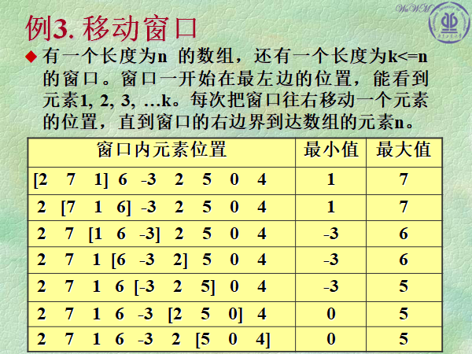

# 题目：Chap01-3 线性结构 表中“移动窗口”求最小值

## 问题描述

## 输入格式
第一行，数组元素个数 n。

第二行，n 个数组元素。

第三行，移动窗口大小。
## 输出格式
表中 “移动窗口” 的最小值。
## 输入样例
	9
	2 7 1 6 -3 2 5 0 4
	3

## 输出样例
	1 1 -3 -3 -3 0 0

----

## AC 代码

	/**
	 * Chap01-3 线性结构 表中“移动窗口”求最小值
	 */
	#include <bits/stdc++.h>
	
	using namespace std;
	
	class Solution {
	public:
	    vector<int> minInWindows(const vector<int>& num, unsigned int _size) {
	        vector<int> minInWindows;
	        if(num.size() >= _size && _size >= 1) {
	            // 双端队列
	            deque<int> index;
	
	            for(int i = 0; i < _size; ++i) {
	                while(!index.empty() && num[i] < num[index.back()])
	                    index.pop_back();
	
	                index.push_back(i);
	            }
	
	            for(int i = _size; i < num.size(); ++i) {
	                minInWindows.push_back(num[index.front()]);
	                // 如果已有的数字大于待存入的数字，那么这些数字不可能是滑动窗口的最小值
	                while(!index.empty() && num[i] < num[index.back()])
	                    // 从队列尾部删除
	                    index.pop_back();
	                // 如果队列头部的数字已经从窗口里滑出，那么滑出的数字也需要从队列头的头部删除
	                if(!index.empty() && index.front() <= (int)(i - _size))
	                    index.pop_front();
	
	                index.push_back(i);
	            }
	            minInWindows.push_back(num[index.front()]);
	        }
	        return minInWindows;
	    }
	};
	
	int main() {
	    Solution so;
	    int n, in;
	    scanf("%d", &n);
	    vector<int> vec;
	    for(int i = 0; i < n; i++) {
	        scanf("%d", &in);
	        vec.push_back(in);
	    }
	    int _size;
	    scanf("%d", &_size);
	    vector<int> ans = so.minInWindows(vec, _size);
	    for(int i = 0; i < ans.size(); i++) {
	        cout << ans.at(i) << " ";
	    }
	    return 0;
	}
