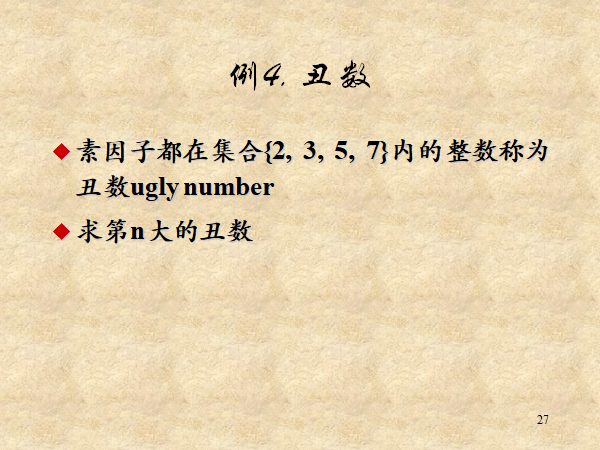

# 题目：Chap03-2 优先队列和二叉堆 丑数

## 问题描述

丑数是指素因子都在集合 {2,3,5,7} 内的整数，第一个丑数是 1。

现在输入 n(n < 6000)，输出第 n 大的丑数。

时间限制为 1 秒，空间限制为 64 MB。
## 输入格式

## 输出格式

## 输入样例

## 输出样例

----

## AC 代码

	/**
	 * Chap03-2 优先队列和二叉堆 丑数
	 */
	#include <bits/stdc++.h>
	typedef long long ll;
	using namespace std;
	
	ll heap[24001]; // 堆数组
	int i;          // 计数器
	int n;
	int tot;        // 堆的大小
	ll j, k;
	
	ll get() {                  // 取出堆中的最小元素
	    int fa = 1, son = 2 * fa; // fa 和 son 用于调整的下标，预处理下标
	    ll _min, tmp;             // min 存取最小值，tmp 用于交换
	    _min = heap[1];           // 堆根的元素就是最小的元素
	    heap[1] = heap[tot];      // 把堆最后的元素调整到第一个
	    tot--;                    // 取出了一个元素，堆的大小减 1
	    while (son <= tot) {
	        // 如果有两个孩子，取出较小的一个
	        if (son < tot && heap[son] > heap[son + 1])
	            son++;
	        // 如果父亲比儿子大，则需要交换
	        if (heap[fa] > heap[son]) {
	            tmp = heap[fa];
	            heap[fa] = heap[son];
	            heap[son] = tmp;
	            // 继续判断当前元素是否符合
	            fa = son;
	            son = fa * 2;
	        } else {
	            // 如果符合就跳出循环
	            son = tot + 1;
	        }
	    }
	    return _min;
	}
	
	void put(ll key) {   // 在堆中加入新的元素
	    int fa, son;       // fa 和 son 为用于调整的下标
	    ll tmp;            // tmp 用于交换
	    heap[++tot] = key; // 在堆尾加入新的元素
	    son = tot;
	    fa = son / 2; // 预处理下标
	    while (fa > 0) {
	        // 如果父亲比儿子大，则需要交换
	        if (heap[fa] > heap[son]) {
	            tmp = heap[fa];
	            heap[fa] = heap[son];
	            heap[son] = tmp;
	            // 继续判断当前元素
	            son = fa;
	            fa /= 2;
	        } else
	            fa = 0; // 如果符合就跳出循环
	    }
	}
	int main() {
	    int n;
	    scanf("%d", &n); // 读入 n
	    memset(heap, 0, sizeof(heap));
	    // 预处理堆数组
	    heap[1] = 1;
	    tot = 1;
	    i = 0;
	    j = 0;
	    k = 0;
	    while (i < n) {
	        j = k;
	        k = get();
	        // 重复元素如 6 照样存进去，取出来时判断前后两次是否一样
	        // 一样不做处理，不同则要加入新的元素。
	        if (k != j) {
	            i++; // 取出了不同的数，计数器加 1
	            put(k * 2);
	            put(k * 3);
	            put(k * 5);
	            put(k * 7);
	        }
	    }
	    cout << k;
	    return 0;
	}

