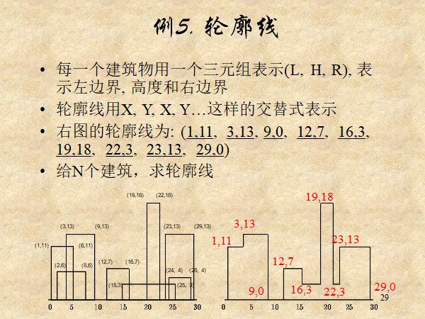

# 题目：Chap03-3 优先队列和二叉堆 轮廓线

## 问题描述

有一些建筑物，从正面看去它们互相遮挡，只能看到一个轮廓线。你对它产生了兴趣，想要求出这个轮廓线。

时间限制为 1 秒，空间限制为 64MB。
## 输入格式
第一行包含一个整数 n(n<=300000)，代表建筑的总数。

接下来 n 行每行 3 个整数，L[i],R[i],H[i]（0<L[i],R[i],H[i]<=10^6），分别代表建筑物的左边界、右边界和高度。
## 输出格式
输出有若干行，每行 2 个整数 x 和 h，分别代表位置和高度。从左向右当轮廓线的高度发生改变时就输出一行。

## 输入样例
	8
	1 5 11
	3 9 13
	2 6 6
	12 16 7
	19 22 18
	23 29 13
	16 26 3
	24 28 5
## 输出样例
	1 11
	3 13
	9 0
	12 7
	16 3
	19 18
	22 3
	23 13
	29 0

----